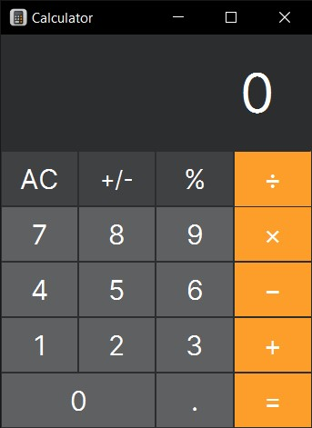

# MacOs Calculator Clone in Java

<div align="center">
  
</div>

This is a simple calculator clone for MacOS in Java. It is a simple project for my Java class. It is a simple calculator that can do the basics.

## Installation

### Using the JAR file

You can download the JAR file from the [here](dist/Taschenrechner.jar). You can run it by double-clicking on it or by running the following command in the terminal:

```bash
java -jar Taschenrechner.jar
```

### Building from source

You can download the project and run it in your favorite IDE. I used NetBeans for this project (I know, I know, I should use IntelliJ IDEA, but for my defense, I wrote the code in VS Code and used NetBeans to run it).

Additional things to mention:

- The project is in Java 8 (Don't ask me why, I don't know)
- The project uses JavaFX
- The project uses Ant

## Usage

I think you know how to use a calculator, but here are some instructions:

- Click on a number to input it in the display
- Click on an operation to select it
- Tada! You have a result

## Additional Functions

- Resize the window to see a more advanced calculator. It has more functions. (like square root, power, etc.)
- Click on the result to delete the last digit

## Known Issues

- The calculator is not perfect. It is a simple project for a Java class
- If you entered the expert mode, you can't go back to the simple mode
- Input from the keyboard is not supported
- Glitches in the design
- `Taschenrechner` means calculator in German, I left it like that because I am a German student and I forgot to change it :skull:

## Contributing and using the code

You are free to use the code in any way you want but don't expect much. It is a simple project for a Java class and I am still learning Java so the code is not perfect.

If you want to contribute, feel free to do so. I am always open to suggestions and improvements.

## License and Credits

[MIT](LICENSE)

The project is created by me, things that I used are:

- [JavaFX](https://openjfx.io/) - For the GUI
- [Inter Font](https://rsms.me/inter/) - For the font
- [Apple Calculator](https://support.apple.com/guide/calculator/welcome/mac) - For the design and inspiration

You made it to the end of the README. Congratulations! 🎉

Feel free to start this repo and check out my other projects on [GitHub](https://github.com/JMcrafter26) :smile:
